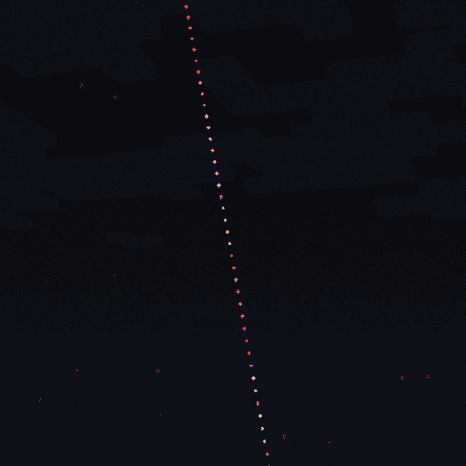

## > 函数模板介绍

### 一、烟花模板（调用模块`basic_fireworks.py`）

1. basic_single_layer_firework
   **单层烟花**
   参数包括：

| 参数名                                       | 含义                        | 数据类型            |
|-------------------------------------------|---------------------------|-----------------|
| tick                                      | 烟花爆炸时的游戏刻                 | int             |
| x、y、z                                     | 烟花爆炸的坐标                   | float           |
| start_color、end_color                     | 烟花粒子渐变色的rgb               | (int, int, int) |
| speed                                     | 烟花爆炸初速度                   | float           |
| horizontal_angle_step、vertical_angle_step | 烟花轨迹方向水平、竖直方向枚举角度间隔（单位为°） | int             |
| duration                                  | 烟花轨迹前进时间（单位为秒）            | float           |
| lifetime                                  | 烟花粒子存在时间（单位为秒）            | float           |

> Example:

2. basic_double_layer_firework
   **双层烟花**
   参数包括：

| 参数名                                                    | 含义                                                | 数据类型            |
|--------------------------------------------------------|---------------------------------------------------|-----------------|
| tick                                                   | 烟花爆炸时的游戏刻                                         | int             |
| x、y、z                                                  | 烟花爆炸的坐标                                           | float           |
| inner_start_color、inner_end_color                      | 内层烟花粒子渐变色的rgb                                     | (int, int, int) |
| outer_start_color、outer_end_color                      | 外层烟花粒子渐变色的rgb                                     | (int, int, int) |
| inner_speed、outer_speed                                | 内、外层烟花爆炸初速度                                       | float           |
| outer_horizontal_angle_step, outer_vertical_angle_step | 外层烟花轨迹方向水平、竖直方向枚举角度间隔（单位为°）（没有内层参数，会根据速度比例关系自动计算） | int             |
| duration                                               | 烟花轨迹前进时间（单位为秒）                                    | float           |
| lifetime                                               | 烟花粒子存在时间（单位为秒）                                    | float           |

> Example:

3. directional_firework
   **聚向烟花**
   参数包括：

| 参数名                                                  | 含义                        | 数据类型            |
|------------------------------------------------------|---------------------------|-----------------|
| tick                                                 | 烟花爆炸时的游戏刻                 | int             |
| x、y、z                                                | 烟花爆炸的坐标                   | float           |
| start_color、end_color                                | 烟花粒子渐变色的rgb               | (int, int, int) |
| speed                                                | 烟花爆炸初速度                   | float           |
| direction_horizontal_angle, direction_vertical_angle | 烟花爆炸方向水平、垂直角（类似经纬度）（单位为°） | int             |
| spread_angle                                         | 轨迹方向偏移范围（单位为°）            | int             |
| track_count                                          | 轨迹数量                      | int             |
| duration                                             | 烟花轨迹前进时间（单位为秒）            | float           |
| lifetime                                             | 烟花粒子存在时间（单位为秒）            | float           |

> Example:

4. clustered_firework
   **集束烟花**
   参数包括：

| 参数名                                       | 含义                        | 数据类型            |
|-------------------------------------------|---------------------------|-----------------|
| tick                                      | 烟花爆炸时的游戏刻                 | int             |
| x、y、z                                     | 烟花爆炸的坐标                   | float           |
| start_color、end_color                     | 烟花粒子渐变色的rgb               | (int, int, int) |
| speed                                     | 烟花爆炸初速度                   | float           |
| horizontal_angle_step、vertical_angle_step | 烟花轨迹方向水平、竖直方向枚举角度间隔（单位为°） | int             |
| spread_angle                              | 轨迹方向偏移范围（单位为°）            | int             |
| track_count                               | 轨迹数量                      | int             |
| duration                                  | 烟花轨迹前进时间（单位为秒）            | float           |
| lifetime                                  | 烟花粒子存在时间（单位为秒）            | float           |

> Example:

### 二、发射轨迹模板（调用模块`firework_trajectories.py`）

1. launch_trajectory
   **基础曲线发射轨迹**
   参数包括：

| 参数名                   | 含义                            | 数据类型            |
|-----------------------|-------------------------------|-----------------|
| end_tick              | 轨迹结束时的游戏刻                     | int             |
| x0、y0、z0              | 轨迹起始坐标                        | float           |
| x1、y1、z1              | 轨迹终止坐标                        | float           |
| start_color、end_color | 轨迹粒子渐变色的rgb                   | (int, int, int) |
| duration              | 烟花轨迹前进时间（单位为秒）                | float           |
| k、m0                  | 模拟抛体的空气阻力系数、质量（k与m0的比例决定轨迹形状） | float           |
| rho                   | 粒子密度，即单位tick生成的粒子数            | int             |
| lifetime              | 轨迹粒子存在时间（单位为秒）                | float           |

> Example:

2. launch_spark_trajectory
   **火花发射轨迹**
   参数包括：

| 参数名            | 含义                            | 数据类型  |
|----------------|-------------------------------|-------|
| end_tick       | 轨迹结束时的游戏刻                     | int   |
| x0、y0、z0       | 轨迹起始坐标                        | float |
| x1、y1、z1       | 轨迹终止坐标                        | float |
| duration       | 烟花轨迹前进时间（单位为秒）                | float |
| k、m0           | 模拟抛体的空气阻力系数、质量（k与m0的比例决定轨迹形状） | float |
| lifetime       | 轨迹粒子存在时间（单位为秒）                | float |
| particle_count | 每个tick生成的火花数量                 | int   |

> Example:

3. trajectory_with_random_offset
   **随机扰动发射轨迹**
   参数包括：

| 参数名             | 含义                            | 数据类型  |
|-----------------|-------------------------------|-------|
| end_tick        | 轨迹结束时的游戏刻                     | int   |
| x0、y0、z0        | 轨迹起始坐标                        | float |
| x1、y1、z1        | 轨迹终止坐标                        | float |
| duration        | 烟花轨迹前进时间（单位为秒）                | float |
| k、m0            | 模拟抛体的空气阻力系数、质量（k与m0的比例决定轨迹形状） | float |
| lifetime        | 轨迹粒子存在时间（单位为秒）                | float |
| interval_ticks  | 扰动频率，即每多少tick生成一个随机偏移点        | int   |
| points_per_tick | 每个tick生成的粒子数量                 | int   |

> Example:

4. thick_trajectory_with_random_offset
   **随机扰动发射轨迹（粗）**
   在随机扰动发射轨迹的基础上，原先一个粒子的位置在一定范围内生成多个粒子
   参数包括：

| 参数名                     | 含义                            | 数据类型  |
|-------------------------|-------------------------------|-------|
| end_tick                | 轨迹结束时的游戏刻                     | int   |
| x0、y0、z0                | 轨迹起始坐标                        | float |
| x1、y1、z1                | 轨迹终止坐标                        | float |
| duration                | 烟花轨迹前进时间（单位为秒）                | float |
| k、m0                    | 模拟抛体的空气阻力系数、质量（k与m0的比例决定轨迹形状） | float |
| lifetime                | 轨迹粒子存在时间（单位为秒）                | float |
| interval_ticks          | 扰动频率，即每多少tick生成一个随机偏移点        | int   |
| points_per_tick         | 每个tick生成的粒子数量                 | int   |
| range_x、range_y、range_z | 每组粒子生成的范围                     | float |
| particle_count          | 每组粒子的数量                       | int   |

> Example:

5. expanding_trajectory_with_random_offset
   **扩散随机扰动发射轨迹**
   在随机扰动发射轨迹（粗）的基础上，轨迹粒子向外扩散
   参数包括：

| 参数名                     | 含义                            | 数据类型  |
|-------------------------|-------------------------------|-------|
| end_tick                | 轨迹结束时的游戏刻                     | int   |
| x0、y0、z0                | 轨迹起始坐标                        | float |
| x1、y1、z1                | 轨迹终止坐标                        | float |
| duration                | 烟花轨迹前进时间（单位为秒）                | float |
| k、m0                    | 模拟抛体的空气阻力系数、质量（k与m0的比例决定轨迹形状） | float |
| lifetime                | 轨迹粒子存在时间（单位为秒）                | float |
| interval_ticks          | 扰动频率，即每多少tick生成一个随机偏移点        | int   |
| points_per_tick         | 每个tick生成的粒子数量                 | int   |
| range_x、range_y、range_z | 每组粒子生成的范围                     | float |
| particle_count          | 每组粒子的数量                       | int   |
| speed_factor            | 扩散速率                          | float |

> Example:

